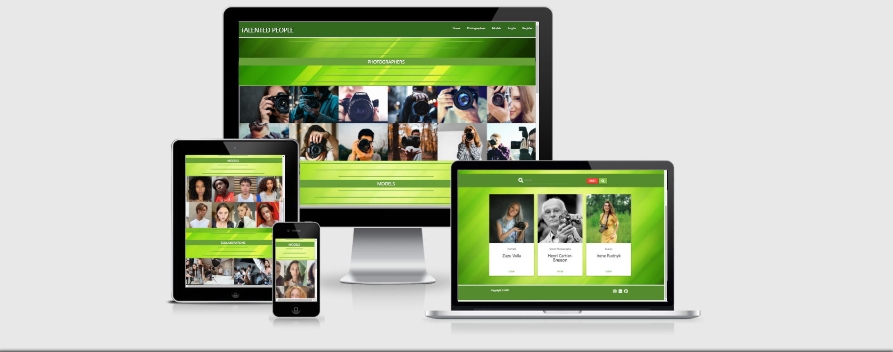
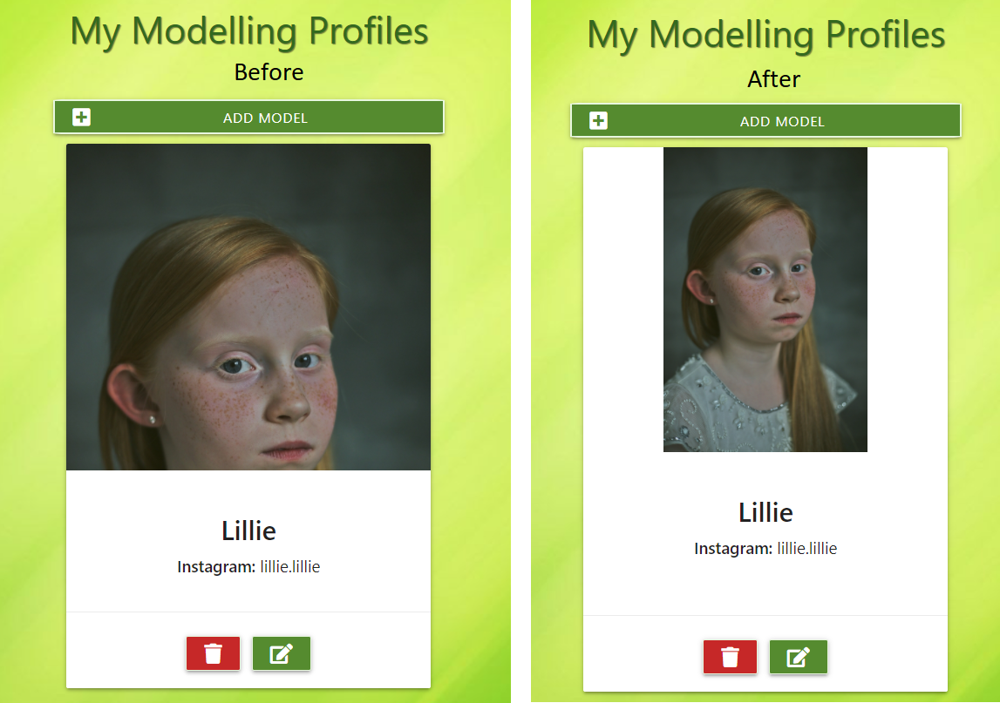
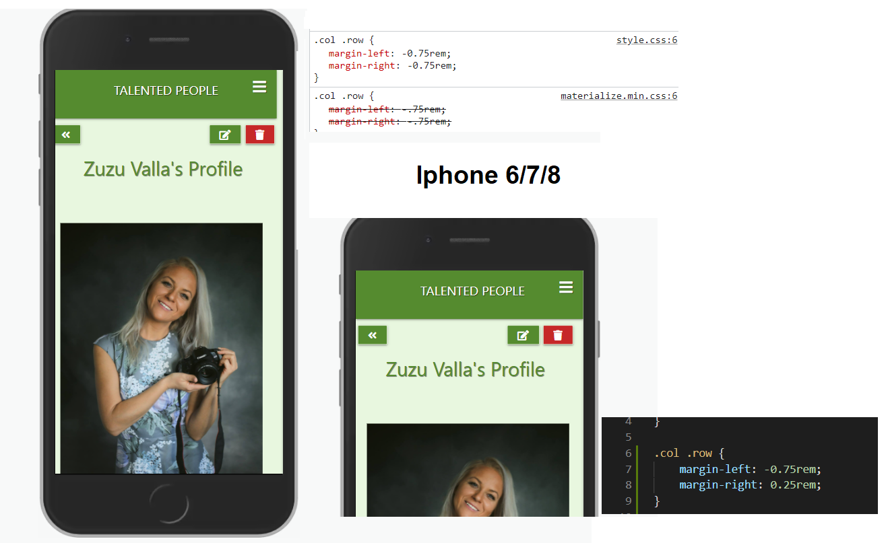
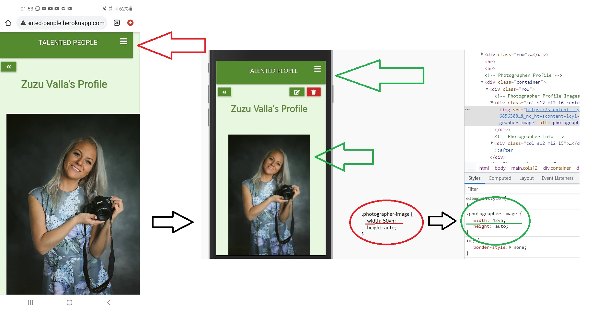
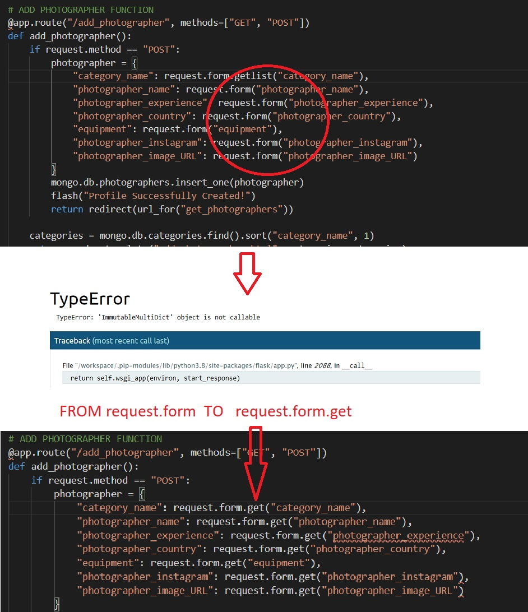

# TALENTED PEOPLE
## Code Institute: Milestone Project 3

Created by Ondrej Valla

### View [TALENTED PEOPLE](https://talented-people.herokuapp.com/) website on Heroku.
---

# Table of Content
1. [Overview](#overview)

2. [Goals](#goals)

3. [User Experience](#user-experience)
    1. [User Stories](#user-stories)
    2. [Website Structure](#website-structure)
    3. [Website Design](#website-design)
    4. [Images](#images)
    5. [Colors](#colors)
    6. [Icons](#icons)

4. [Wireframes](#wireframes)

5. [Features](#features)
    1. [Existing Features](#existing-features)
    2. [Features left to implement](#features-left-to-implement)

6. [Used Technologies](#used-technologies)

7. [Testing](#testing)
    1. [HTML Validation](#html-validation)
    2. [CSS Validation](#css-validation)
    3. [JavaScript](#javascript)
    4. [Python](#python)
    5. [Performance](#performance)
    6. [Testing User Stories](#testing-user-stories)

8. [Bugs](#bugs)

9. [Deployment](#deployment)

10. [Credits](#credits)
---

# Overview

The TALENTED PEOPLE website is here to allow all users to browse between profiles of Talented Photographers and Talented Models. The primary target audience should be photographers and models of all ages. The secondary audience is all talented people from different industries, planning their projects and looking for photographers and models for collaboration. Whether they are a make-up artists, hairstyle artists, etc., everybody is welcomed and able to browse through profiles. Users are able to register and create photographer's or model's portfolios for all users to view.

---

# Goals

### User goals:
1. The website to be user-friendly.
2. The website to be visually appealing to users.
3. Easy to navigate website.
4. Ability to register / log in 
5. Registered users can easily Create, Read, Update and Delete as many photographers' and models' profiles as they like.

### Developer/Admin goals:
1. Have a well-designed / responsive website.
2. Get lots of registered users with plenty of photographers / models portfolios created.
3. To be able to create / manage photography categories.
4. Use MongoDb database effectively.
---

# User Experience

### User Stories

#### General Site Users 

   As a general site user, 
1. I would like to see the content of the page before I decide whether or not to register.
2. I would like to see the content, be able to browse photographers' and models' profiles.
3. It would be great if I could search through all profiles, to see if my friends photographers / models are already here.
4. I would like to find out more through social media.
5. I like programming and would like to see this website's repositories.

#### Registered Users  

   As a registered user,
1. I would like to be able to easily login and log out.
2. I would like to create my profile as a photographer.
3. I would like to create my profile as a model.
4. If I have forgotten to add some pieces of information while creating my profile, I would like to add them later on.
5. I would like to add some extra images to my portfolio.

#### Admin User

   Me as an Admin user,
1. I would like to be able to create new categories.
2. Edit existing categories.
3. Delete categories no longer needed.
4. MongoDb database to store page content effectively and safely.

---

### Website Structure

**Top Navbar** Navbar displays different navigation buttons, depending on the user:
-  Navbar buttons *Displaying to not signed in users* : Home, Photographers, Models, Login, Register
-  Navbar buttons *Displaying to signed-in users* : Home, Photographers, Models, Profile, Log Out
-  Navbar buttons *Displaying Admin user ONLY* : Home, Photographers, Models, Profile, Categories, Log Out

**Home page** Home page is split into four sections from top to bottom, 
- Photographers: *Displaying to All users*: h5 heading and Materialize Slider with images of random photographers.
- Models: *Displaying to All users*: h5 heading and Materialize Slider with images of random models.
- Collaborations: *Displaying to All users*: h5 heading and Materialize Slider with images of random behind the scene collaborations.
-  
    And You: *Displaying to signed-in users*: h5 heading with anchor link "AND YOU" taking the user to profile.html. Underneath, is the button See Your Profile also linked to profile.html.
    
    Join Now: *Displaying to not signed in users*: h5 heading with anchor link "JOIN NOW" taking the user to register.html. Underneath, are two buttons Login and Register linked to login.html and register.html. 

**Photographers page** 
- *Displaying to All users*: Photographers page displays Search Bar and Materialize Cards with portfolios of all Photographers in the database.
- *Displaying to not signed in users*: On top of the page is the heading "JOIN OUR COMMUNITY" and anchor link "REGISTER NOW" taking user to register.html.
- *Displaying to signed-in users*: On top of the page is the button Add Photographer linked to add_photographer.html.

**Add Photographer page** allows *signed-in users* to create Photographer's portfolio.
- *Displaying to signed-in users*: After clicking on one of Add Photographer buttons, the user has an option to create a Photographer portfolio. Whether his/her own, if the user is a photographer, or someone else's.
- *Displaying to not signed in users*: If not signed in user gets the access, the header "Add Photographer" and "No Access" are shown. The Add Photographer form disappears.

**Edit Photographer page** allows *signed-in users* to edit Photographer's portfolio created by the same user.
- *Displaying to not signed in users*: If not signed in user gets the access, the header "No Access" is shown. The Edit Photographer form disappears.

**Models page** 
- *Displaying to All users*: Models page displays Search Bar and Materialize Cards with portfolios of all Models in the database.
- *Displaying to not signed in users*: On top of the page is the heading "JOIN OUR COMMUNITY" and anchor link "REGISTER NOW" taking the user to register.html.
- *Displaying to signed-in users*: On top of the page is the button Add Model linked to add_model.html.

**Add Model page** allows *signed-in users* to create Model's portfolio.
- *Displaying to signed-in users*: After clicking on one of Add Model buttons, the user has an option to create a Model portfolio. Whether his/her own, if the user is a model, or someone else's.
- *Displaying to not signed in users*: If not signed in user gets the access, the header "Add Model" and "No Access" are shown. The Add Model form disappears.

**Edit Model page** allows *signed-in users* to edit Model's portfolio created by the same user.
- *Displaying to not signed in users*: If not signed in user gets the access, the header "No Access" is shown. The Edit Model form disappears.

**Profile page**
- *Displaying to signed-in users*: The profile page is split into two sections: 

-My Photography Profiles 
    At the beginning, when the user has no Photographer Profile created, the page shows the message: You don't have any Photographer's Profile created yet! If You wish, create one here. Followed by the button Add Photographer linked to add_photographer.html.

Once the Photographer profile(s) are added, the Materialize cards with Photographer's portfolio, Edit, and Delete buttons are shown.
    
-My Modelling Profiles
    At the beginning, when user has no Model Profile created, page shows the message: You don't have any Model's Profile created yet! If You wish, create one here. Followed by the button Add Model linked to add_model.html.

Once the Model profile(s) are added, the Materialize cards with Model's portfolio, Edit and Delete buttons are shown.

- *Not signed in users*: The profile page does not allow access to unregistered / not signed-in users. 

**Categories page**
- *Displaying to Admin user ONLY*: For the Admin user, Add Category button is displayed. Edit and Delete buttons at the bottom of each category card are also displayed and available to be used by the Admin.

- *Displaying to all users*: If no admin user gets access to the Categories page, The categories page displays all photography categories currently existing in the database. With no Add, Edit, or Delete functions.

**Register page**
- The register page has three input fields: Your First Name, Your Username and Password.
    If the username already exists, a flash message show up.
    Underneath the Register form is the link to login.html for already registered users.

**Log In page**
- Log In page has two input fields: Your Username and Password. 
    If incorrect username or password, a flash message shows up.
    Underneath the login form is the link to register.html for not yet registered users.
---

### Website Design

- The main reason, why I did choose the green theme is because I think the green color is relaxing, therefore believe it could help to deliver a good User Experience to website visitors. 
- I have chosen a combination of different shades of Green and White background colors, together with Dark Green, White, and Black text colors.
- Home page image collages together with profile portfolio's images are boosting the whole feel of the website.
- As more users will be adding more images, the variety of colors and images will get bigger and bigger.

### Images

- Website's background image is downloaded from:
[www.teahub.io](https://teahub.io/photos/full/1-19165_full-hd-background-colour.jpg)

- Home Page PHOTOGRAPHERS collages are created from images downloaded from:
[www.google.co.uk/photographers search](https://www.google.co.uk/search?q=photographers&tbm=isch&tbs=rimg:CQ_1ry5nTRpYlYZjmYz63RJa9sgIGCgIIABAA&hl=en&sa=X&ved=0CBwQuIIBahgKEwioqP6Eg_3yAhUAAAAAHQAAAAAQlQE&biw=1519&bih=696)

- Home Page MODELS collages are created from images downloaded from:
[www.models.com/newfaces](https://models.com/newfaces/tag/uk)

- Home Page COLLABORATIONS collages are created from images downloaded from:
[www.google.co.uk/photoshoot behind the scenes search](https://www.google.co.uk/search?q=photoshoot+behind+the+scenes&tbm=isch&ved=2ahUKEwib6cum-oPzAhWP8IUKHb2FBO0Q2-cCegQIABAA&oq=photoshoot&gs_lcp=CgNpbWcQARgAMgcIIxDvAxAnMggIABCABBCxAzIFCAAQgAQyCAgAEIAEELEDMgUIABCABDIFCAAQgAQyBQgAEIAEMgUIABCABDIFCAAQgAQyBQgAEIAEOgQIABBDOgsIABCABBCxAxCDAVDktQ1YzdYNYNLvDWgAcAB4AIABTogBvQaSAQIxM5gBAKABAaoBC2d3cy13aXotaW1nwAEB&sclient=img&ei=XHZDYZvLNo_hlwS9i5LoDg&bih=696&biw=1519&hl=en)

### Colors

- The website's color theme is MOSTLY the combination of different shades of Light green darken 1-4 class of Materialize Color Palette and white-text class.

- [Materialize Color Palette](https://materializecss.com/color.html)

- 

### Icons

- To achieve better appearance and user experience, Font Awesome icons are used in this website.
- The source: [Font Awesome](https://fontawesome.com/)

---

# Wireframes

* [Home Page](static/wireframes/home-page.png)
* [Register](static/wireframes/register.png)
* [Login](static/wireframes/login.png)
* [Profile](static/wireframes/profile-portfolio.png)
* [Edit Profile](static/wireframes/edit-profile.png)
* [Photographers/Models Pages](static/wireframes/photographers-page.png)
* [Add Photographer/Add model](static/wireframes/add-photographer.png)
* [Categories](static/wireframes/categories.png)
* [Add Category](static/wireframes/add-category.png)

---

# Features

### Existing Features

* CRUD functionality

* The website will load and display the Home page (home.html). With the navbar and footer.

* Users can browse most of the content, including Home Page, Photographers Page, Models Page, Log In Page, and Register Page without registering or logging in.

* As the user is not yet registered or logged in, the home page, photographers page, and models page are showing hints: Join Us Now, and Register Now, to prompt unregistered / unsigned users to register or log in.

* Once registered and logged in, the Profile page comes up and displays the flash message: Welcome {user's First name}.
[Screenshot](static/images/readme-files/welcome-username.png)

* For active users, Add Photographer and Add Model buttons are displayed in users' profiles same as at the top of the photographers.html and the models.html.
[Screenshot](static/images/readme-files/add-photographer-model-1.png)

* When Portfolio(s) are added, the Profile page will display all portfolios created by the user, sorted into two groups: My Photography profiles and My Modelling profiles. [Screenshot](static/images/readme-files/user-profile-2.png)

* Existing portfolio(s) card(s), created by the user have two buttons: Edit Button and Delete Button. [Screenshot](static/images/readme-files/edit-delete-buttons.png)

* When Edit Button is clicked, the user is transferred to edit_photographer.html or edit_model.html. [Screenshot](static/images/readme-files/edit-photographer.png)

* When Delete Button is clicked, the delete modal pops up to ensure the user wants to proceed. Yes to delete, No to return. [Screenshot](static/images/readme-files/delete-modal.png)

* photographers.html and models.html displays profiles of Photographers and Models stored in the database to all users, regardless of whether or not they are registered / logged in. For unregistered users, Join us and Register now headings are displayed. For active users, Add Photographer and Add Model buttons are displayed. [Screenshot 1](static/images/readme-files/join-our-community.png)   [Screenshot 2](static/images/readme-files/add-photographer-2.png)

* When an individual portfolio card is clicked, the page of photographer.html or model.html is loaded, displaying selected/clicked portfolio (found by the id in the database) with additional information, filled in during the add_photographer or add_model methods. [Screenshot](static/images/readme-files/portfolio-page.png)

* When the individual portfolio is being displayed, to the user, if the current user is the same user as created by for selected portfolio, Edit Button and Delete Button are displayed. Once clicked (same as described above).

* Search portfolio feature is available for all users, on photographers.html and models.html. [Screenshot](static/images/readme-files/add-photographer-2.png)

    photographers.html search bar is searching for photography category and photographer's name.

    models.html search bar is searching for the model's name.
The red reset button reloads both photographers.html and models.html and displays all portfolios again.

* The categories page is only available to the 'admin' user. This page displays all currently created categories in the database. 
The Admin can add, edit and delete the category/categories. 

* Log Out button will log out the current user and the login.html page will display.

### Features left to implement

* Contact Form
* Uploading image files, directly from the PC or Mobile Phone, if possible.
* Add the favorite Photographer or the Model to the Favourite list displayed as a favorite group in profile.html

---
# Used Technologies

* [GitHub](https://github.com/) The platform to write the code of this website.
* [Materialize](https://materializecss.com/) My first ever use of this great library to improve grid layout and colors.
* [jQuery](https://code.jquery.com/) To Initialize Materialize templates
* [MongoDB](https://www.mongodb.com/) Used this database to store user's data.
* [Flask](https://flask.palletsprojects.com/en/2.0.x/) Used Flask framework
* [Font awesome](https://fontawesome.com/) To feature lovely icons, to boost appearance of the website.
* [Favicon](https://favicon.io/) To create TP favicon.
* [Balsamiq](https://balsamiq.com/) Used to create my wireframes.

---
# Testing

### HTML Validation
The [W3C Markup Validator](https://validator.w3.org/) was used to validate the HTML language.
Click below to see individual results:
* [Home](static/images/readme-files/home-html-check.png)
* [Add_Photographer](static/images/readme-files/add-photographer-html-check.png)
* [Edit_Photographer](static/images/readme-files/edit-photographer-html-check.png)
* [Photographer](static/images/readme-files/photographer-html-check.png)
* [Add_Model](static/images/readme-files/add-model-html-check.png)
* [Edit_Model](static/images/readme-files/edit-model-html-check.png)
* [Model](static/images/readme-files/model-html-check.png)
* [Profile](static/images/readme-files/profile-html-check.png)
* [Categories](static/images/readme-files/categories-html-check.png)
* [Add_Category](static/images/readme-files/add-category-html-check.png)
* [Edit_Category](static/images/readme-files/edit-category-html-check.png)
* [Register](static/images/readme-files/register-html-check.png)
* [Login](static/images/readme-files/login-html-check.png)

### CSS Validation
The [W3C Validator](https://jigsaw.w3.org/css-validator/) was used to validate the CSS language.
* Click [here](static/images/readme-files/css-validator.png) to see the result.

### Javascript
The [JS Hint](https://jshint.com/) was used to test JavaScript language.
* Click [here](static/images/readme-files/javascript-validation.png) to see the result.

### Python
The [Pep 8](http://pep8online.com/) was used to check Python language.
* Click [here](static/images/readme-files/pep8-check.png) to see result.

### Performance
The [Google Lighthouse](https://developers.google.com/web/tools/lighthouse) was used to test the performance, accessibility, best practice and SEO of the website.
* Click [here](static/images/readme-files/lighthouse.png) to see result.
* Home page collages images are kept in a higher quality for better visual outcome. This is slightly effecting Mobile loading performance.

## Testing User Stories

### General Site Users:

#### 1. I would like to see the content of the page before I decide whether or not to register.

| Feature |
|---------|
All users are able to browse through all photographers portfolios, same as all models portfolios.

| Action | 
|--------|
When user decide to add his portfolio, just click the Register button. 

| Expected Result |
|-----------------|
Once clicked, The Register page is loaded. User can register.

| Actual Result |
|---------------|
All working correctly.

#### 2. I would like to see the content, be able to browse photographers' and models' profiles.

| Feature |
|---------|
Photographers.html same as Models.html has card layout, displaying all created portfolios of photographers and models.

| Action | 
|--------|
Portfolios displayed in two categories Photographers and Models. Each portfolio card can be clicked on to open separate page with more informations of each portfolio.

| Expected Result |
|-----------------|
All portfolios displaying to all users, regardless of being logged in or registered. Users are able to open each portfolio by clicking on it and see more information about selected photographer or model. If creator of the portfolio profile filled in all input fields, users are able to also see three additional images.

| Actual Result |
|---------------|
All working correctly.

#### 3. It would be great if I could search through all profiles, to see if my friends photographers / models are already here.

| Feature |
|---------|
Search bar available for both categories.

| Action | 
|--------|
User types the search phrase into the search bar. photographers.html search bar is searching category and name. models.html is searching name only.

| Expected Result |
|-----------------|
Search bar will filter portfolios matching search phrase.

| Actual Result |
|---------------|
All working correctly.

#### 4. I would like to find out more through the social media.

| Feature |
|---------|
The Footer has a social section with social media links.

| Action | 
|--------|
After clicking each icon, new tap opens.

| Expected Result |
|-----------------|
User will be taken to social media websites.

| Actual Result |
|---------------|
All working correctly.

#### 5. I like programming and I would like to see this website's repositories.

| Feature |
|---------|
GitHub link in the Footer.

| Action | 
|--------|
Taking user to https://github.com/OndrejValla/TALENTED-PEOPLE

| Expected Result |
|-----------------|
User can scroll through Talented People repositories.

| Actual Result |
|---------------|
All working correctly.

### Registered Users:

#### 1. I would like to be able to easily login and log out.

| Feature |
|---------|
Login page available. Once logged in, Log Out button available to session user.

| Action | 
|--------|
Once user is registered with the first name and unique username, which was not used yet by other user, and password 5-15 characters long, then can perform login and log out process whenever fancy to visit Talented People website.

| Expected Result |
|-----------------|
Same as easy first time Registration, same easy Log In process. Once in the session, user is able to Log Out by clicking Log Out button.

| Actual Result |
|---------------|
All working correctly.

#### 2. I would like to create my profile as a photographer.

| Feature |
|---------|
Add Photographer button available to the session user. Accessible from photographers.html and profile.html

| Action | 
|--------|
Click Add Photographer button and fill up requested form. Click add profile button to submit your input into the MongoDB database.

| Expected Result |
|-----------------|
Users are able to add as many photographers profiles as they like. Whether it is their own profile or profile of another photographer, which they like to share with the community. 

| Actual Result |
|---------------|
All working correctly.

#### 3. I would like to create my profile as a model.

| Feature |
|---------|
Add Model button available to the session user. Accessible from models.html and profile.html

| Action | 
|--------|
Click Add Model button and fill up requested form. Click add profile button to submit your input into the MongoDB database.

| Expected Result |
|-----------------|
Users are able to add as many models profiles as they like. Whether it is their own profile or profile of another model, which they like to share with the community. 

| Actual Result |
|---------------|
All working correctly.

#### 4. If I have forgotten to add some pieces of information while creating my profile, I would like to add them later on.

| Feature |
|---------|
Edit buttons available to the user by whom the portfolio was created. 

| Action | 
|--------|
Click one of edit buttons in photographer.html, model.html or profile.html

| Expected Result |
|-----------------|
Users are able to edit / modify profiles created by them.

| Actual Result |
|---------------|
All working correctly.

#### 5. I would like to add some extra images to my portfolio.

| Feature |
|---------|
Favorite img url 1, 2, and 3 in Add photographer and Add model forms. 

| Action | 
|--------|
Simply copy URLs of your favorite images and add them individually to your portfolio. 

| Expected Result |
|-----------------|
Users are adding up to three additional image URLs. These images are displayed underneath the profile image in photographer.html and model.html.

| Actual Result |
|---------------|
All working correctly.

### Admin User:
### Myself as the Admin user, like to be able to:

#### 1. Create new categories.

| Feature |
|---------|
For Admin's access only, there is Navbar button named Categories. Once in categories.html, the Admin has an option to create new category.

| Action | 
|--------|
In categories.html, click the button Add Category. Once in add_category.html fill up form asking for the new category name and then submit the form by clicking the Add Category button.

| Expected Result |
|-----------------|
Admin is able to create new categories, which are available to all registered users, when creating / managing their portfolios.

| Actual Result |
|---------------|
All working correctly.

#### 2. Edit existing categories.

| Feature |
|---------|
For Admin's access only, in categories.html there is the edit button at the bottom of each category card.

| Action | 
|--------|
By clicking the Edit button at the bottom of the category card, the admin is redirected to edit_category.html. In edit_category.html, the Admin can edit the name of selected category and submit the change by clicking the Save Category button.The Admin has also an option to click the Cancel button, which takes the Admin back to categories.html.

| Expected Result |
|-----------------|
Only the Admin is able to edit category names of the existing categories.

| Actual Result |
|---------------|
All working correctly.

#### 3. Delete categories which are no longer needed.

| Feature |
|---------|
For Admin's access only, in categories.html there is a delete button at the bottom of each category card.

| Action | 
|--------|
By clicking the Delete button at the bottom of the category card, the admin is redirected to the delete modal, where Admin can select Yes, to delete category or No to return back to categories.html.

| Expected Result |
|-----------------|
Once the Yes button in the Delete Modal is clicked, the selected category is permanently deleted from the MongoDB database.

| Actual Result |
|---------------|
All working correctly.

#### 4. MongoDb database to store all page data effectively and safely.
| Feature |
|---------|
All informations are stored safely and effectively in the MongoDB database.

| Action | 
|--------|
All users are able to READ photographers and models data. Users are able to Register, Log In, CREATE portfolios, UPDATE their portfolios and DELETE their portfolios.

| Expected Result |
|-----------------|
TALENTED PEOPLE website allows users to CREATE, READ, UPDATE and DELETE the data stored in the MongoDB database. 

| Actual Result |
|---------------|
All working correctly.

---
# Bugs

1. Navbar buttons for Categories and Models did not work and also were not aligned properly.
   After some investigation, I realized that my code does contain some structural coding mistakes. 
   When I moved the Anchor closing tags after Categories and Models, the issue was sorted.
*

*

---
2. All Cards Images was not aligned well and did not fit cards properly. After doing some Google search I found some ideas on www.W3Schools.com
   CSS
* .card .card-image img {
* object-fit: contain;
* width: 100%;
* height: 280px;
}

*

*

---
3. On Mobile devices, there was an alignment issue of all .col classes. Please see screenshot image for more details:
*

*

---
4. Another alignment issue. This time class .photographer-img Please see screenshot image for more details:
*

*

---
5. Problem when calling @app.route("/add_photographer" Add Photographer function. Please see screenshot image for more details:
*

*

---
6. The Dropdown menu to Select Photography Category was not working as expected. I used code from Code Institute Lesson [Task Manager Auth Tutorial](https://github.com/Code-Institute-Solutions/TaskManagerAuth/blob/main/04-AddingATask-WritingToTheDatabase/02-materialize-select-validation/static/js/script.js) Which fixed this issue. Big Thanks to Mr. Tim Nelson and The Code Institute Team!

*

---

# Deployment

### Requirements:

1. Python3 to run application.
2. Gitpod or another integrated development environment.
3. MongoDB Atlas account for the database development.
4. PIP to install all application requirements.

### How to run this project locally:

1. Click the green clone or download button in [Github](https://github.com/OndrejValla/TALENTED-PEOPLE).
2. Select clipboard button on the right of the link provided.
3. In your terminal, type git clone, paste in the previously copied link and press Enter.
4. Create a file .flaskenv and include 'FLASK_APP=run.py' and 'FLASK_ENV=development'.
5. Install the pip3 with the command 'pip -r requirements.txt' in the terminal.
6. Create a free [MongoDB account](https://cloud.mongodb.com/) and create your database.
7. Create this database collections:

    1. categories
        * _id: '<ObjectId()>'
        * category_name: '<string>'
    
    2. models
        * _id: '<ObjectId()>'
        * model_name:
        * model_experience:
        * model_country:
        * model_about:
        * model_instagram:
        * model_website:
        * model_profile_image_URL:
        * model_image_URL2:
        * model_image_URL3:
        * model_image_URL4:
        * created_by:
    
    3. photographers
        * _id: '<ObjectId()>'
        * category_name:
        * photographer_name:
        * photographer_experience:
        * photographer_country:
        * photographer_equipment:
        * photographer_about:
        * photographer_instagram:
        * photographer_website:
        * photographer_profile_image_URL:
        * photographer_image_URL2:
        * photographer_image_URL3:
        * photographer_image_URL4:
        * created_by:
    
    4. users
        * _id: '<ObjectId()>'
        * first_name:
        * user_name:
        * password:

8. You should now be able to run this application using flask run.

### Deployment to Heroku
1. Create a requirements.txt file by `typing pip3 freeze --local > requirements.txt` into the terminal line.
2. Create a Procfile by typing `echo web: python app.py > Procfile`.
3. `git add -A`, `git commit -m ""` and  `git push`.
4. Navigate to heroku.com and register.
5. Create new app in Heroku and give it a name of your choice.
6. Choose the region that is closest to you.
7. Go to Deploy tab and choose Github (if you are using GitHub).
8. Search the correct repository and click connect.
9. Go to Heroku settings and navigate to Config Vars and set the following:
    * IP = 0.0.0.0
    * MONGO_DBNAME = [Name of MongoDB]
    * MONGO_URI = `mongodb+srv://:@<cluster_name>-qtxun.mongodb.net <database_name>?retryWrites=true&w=majority `
    * PORT = 5000
    * SECRET_KEY = [Secret key] 
10. Go to the Deploy tab and Deploy Branch, ensuring that the master branch is selected.

Enjoy

---
# Credits

## MY DECLARATION:
### I, Ondrej Valla declare, that all the code in this project, TALENTED PEOPLE I have written / typed by myself. The code (Except MATERIALIZE.COM Templates) WAS NOT COPIED and PASTED from someone elses project. However, as I am currently the student, I have to admit that The BIG sources of help and motivation were:

### [The Code Institute learning programme](https://codeinstitute.net/full-stack-software-development-diploma-uk/)

### [Code Institute-Task Manager mini project](https://github.com/Code-Institute-Solutions/TaskManagerAuth)
All Tutorial videos are such a fantastic inspiration. Thanks to these, I created CRUD functions in app.py for the most of my project's pages.

### [Code Institute Submissions](https://github.com/orgs/Code-Institute-Submissions/repositories?page=1) 
I always find it very motivational to look on other student's projects. I love browsing the Code Institute Submissions page and look deeper into interesting projects. There is by my opinion a lots of great projects and ideas. Some of these projects functions I have tried to apply and I had successfully applied into my project BY ADAPTING IT to how I wanted the TALENTED PEOPLE website to appear and perform. I am glad to be a part of this community and I hope that also my project will inspire someone out there.

## Additional Credits:

### HTML5
- I used the [Materializecss.com](https://materializecss.com/) front-end framework for this project, therefore some of the HTML code was already written as a Template. For example: Materialize Navbar / Mobile Navbar (base.html) , Materialize Slider (home.html) , Materialize Cards (photographers.html, models.html, profile.html, categories.html) and the most of the Input Forms. 

- Other helpful websites : [W3-SCHOOLS](https://www.w3schools.com/) and [Stack Over Flow](https://stackoverflow.com/)

### CSS
- The [Materializecss.com](https://materializecss.com/) played a big role in CSS styling of this website. Including the Grid and Color Pallete. 
- Some CSS was also used after research on [Google](https://www.google.co.uk/) and the websites [W3-SCHOOLS](https://www.w3schools.com/) and  [Stack Over Flow](https://stackoverflow.com/)

### Javascript
- The [Materializecss.com](https://materializecss.com/) Initialization of the [jQuery](https://code.jquery.com/) applied in this project.
- The code for 'Select Categories' dropdown menu taken from [Task Manager Mini Project / Auth Tutorial](https://github.com/Code-Institute-Solutions/TaskManagerAuth/blob/main/04-AddingATask-WritingToTheDatabase/02-materialize-select-validation/static/js/script.js)

### Python
- The code for this project, edited to fit this project needs from [Code Institute, Task Manager Mini Project](https://github.com/Code-Institute-Solutions/TaskManagerAuth).

- [Code Institute Submissions](https://github.com/orgs/Code-Institute-Submissions/repositories?page=1) As mentioned above.

### Media
- All images searched and URL copied from [Google Images](https://www.google.co.uk/imghp?hl=en&authuser=0&ogbl)

- Website Green theme background from [teahub.io](www.teahub.io/photos/full/1-19165_full-hd-background-colour.jpg)

- Faces / selfies of Models from  [Models.com](https://models.com/newfaces/tag/uk)

- And more images from several different pages:
[masterpics.in](https://masterpics.in/)
[theconversation.com](https://theconversation.com/)
[www.pinterest.nz](https://www.pinterest.nz/)

- Some images used are property of Zuzu Valla Photography (my spouse)
[zuzuvalla.com](https://zuzuvalla.com/)

### Acknowledgements

- My BIG Thanks goes again to my loved wife Zuzana, for all her support and understanding.
- BIG motivation element for this project was my GREAT Mentor, **Nishant Kumar** [Nishant Kumar Github](https://github.com/nishant8BITS), Thank You Nishant, You Are the Best!
- **The Code Institute** for creating this learning program. THANKS especially to Mr Matt Rudge and Mr Tim Nelson, what a wonderful coaching skills.
- Thank You All!
---
---
---
T Y G